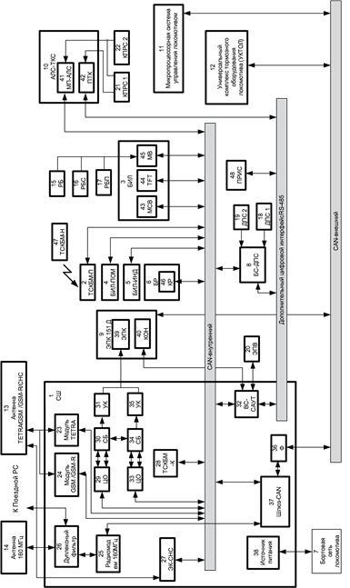
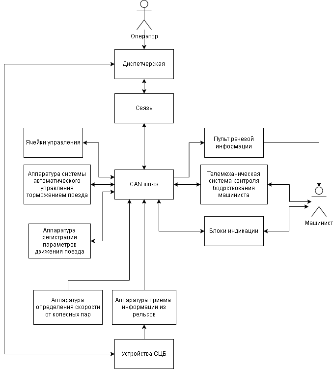
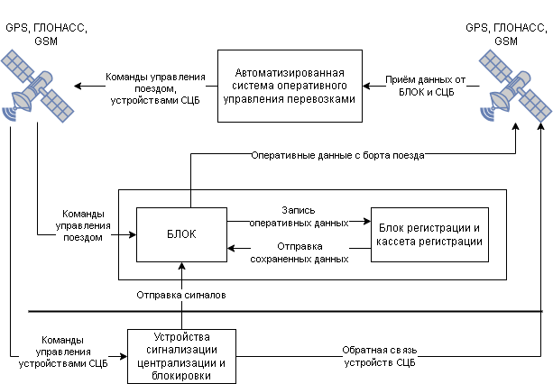
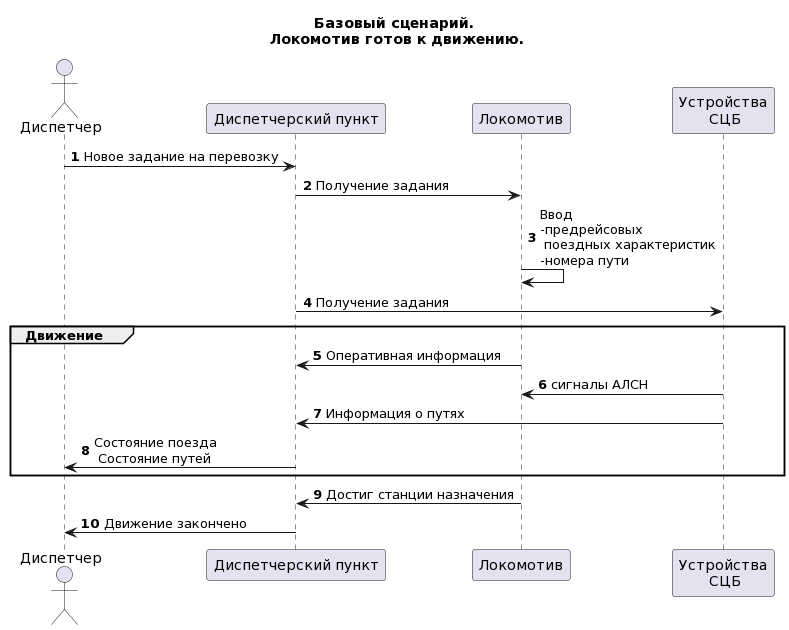
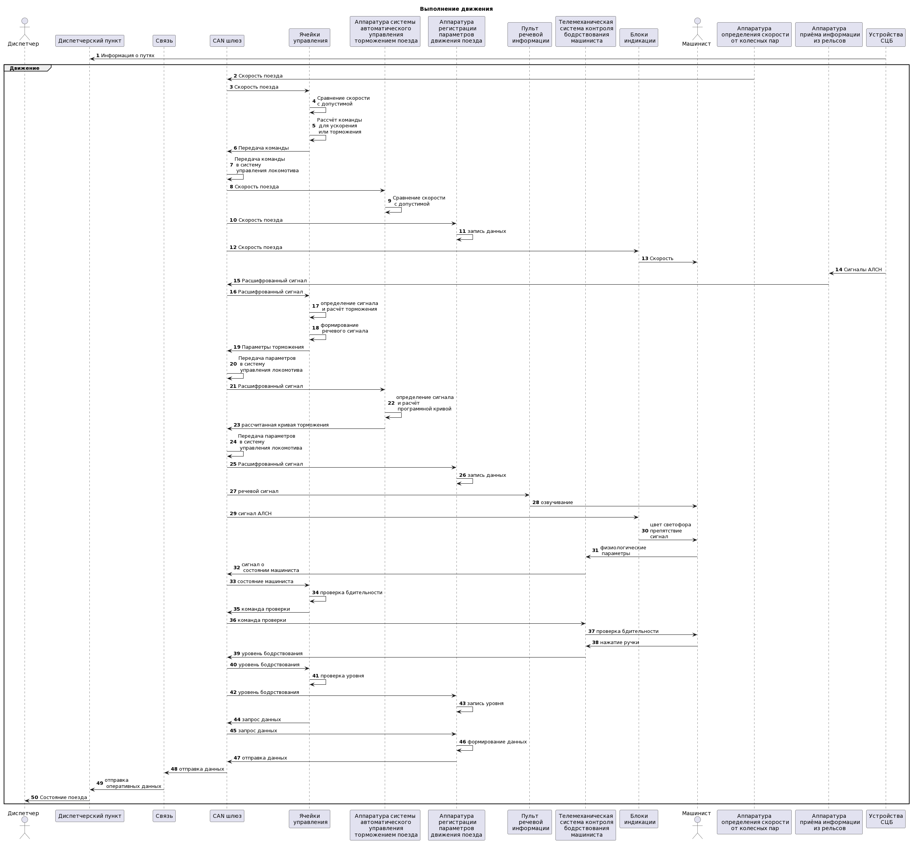
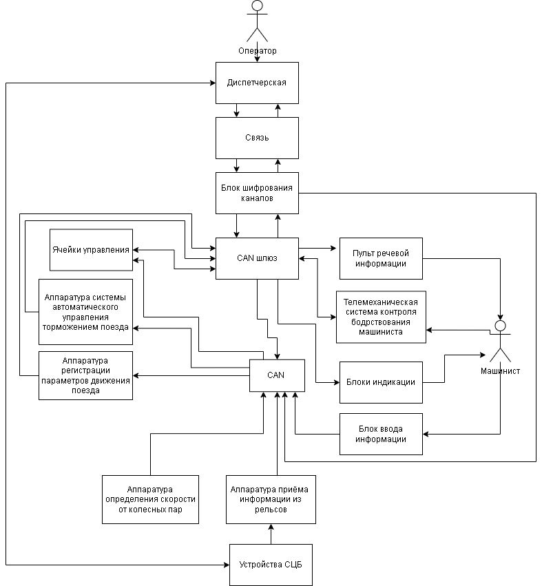
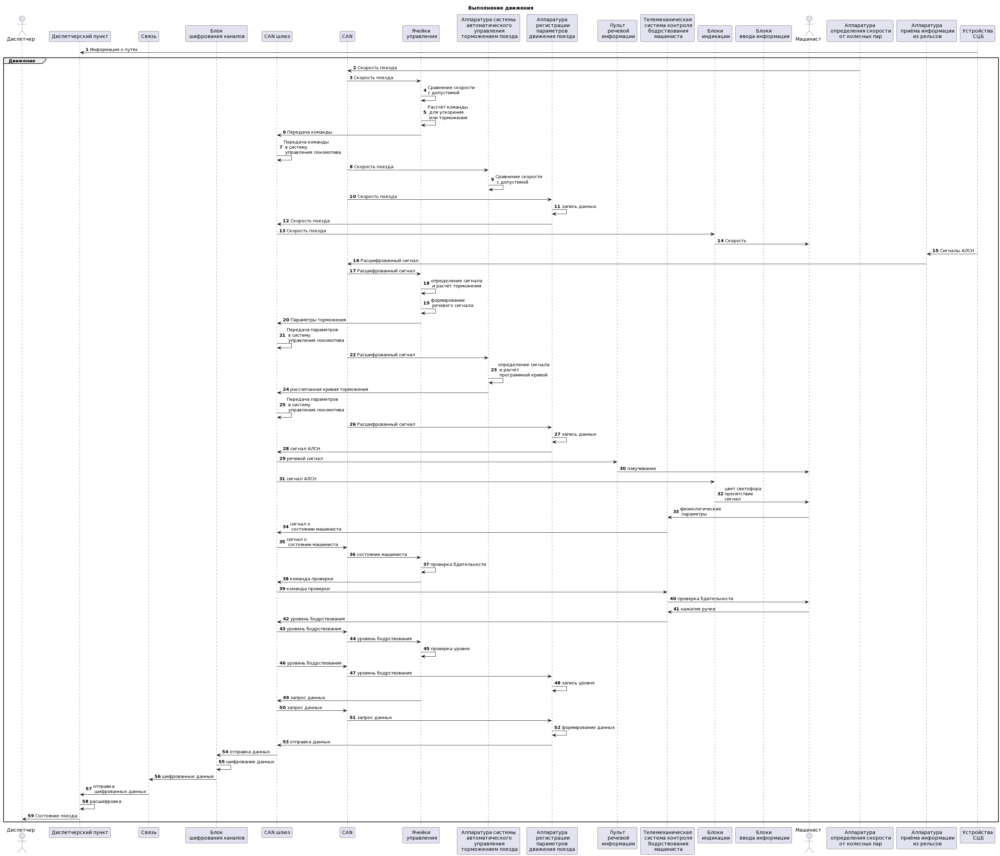
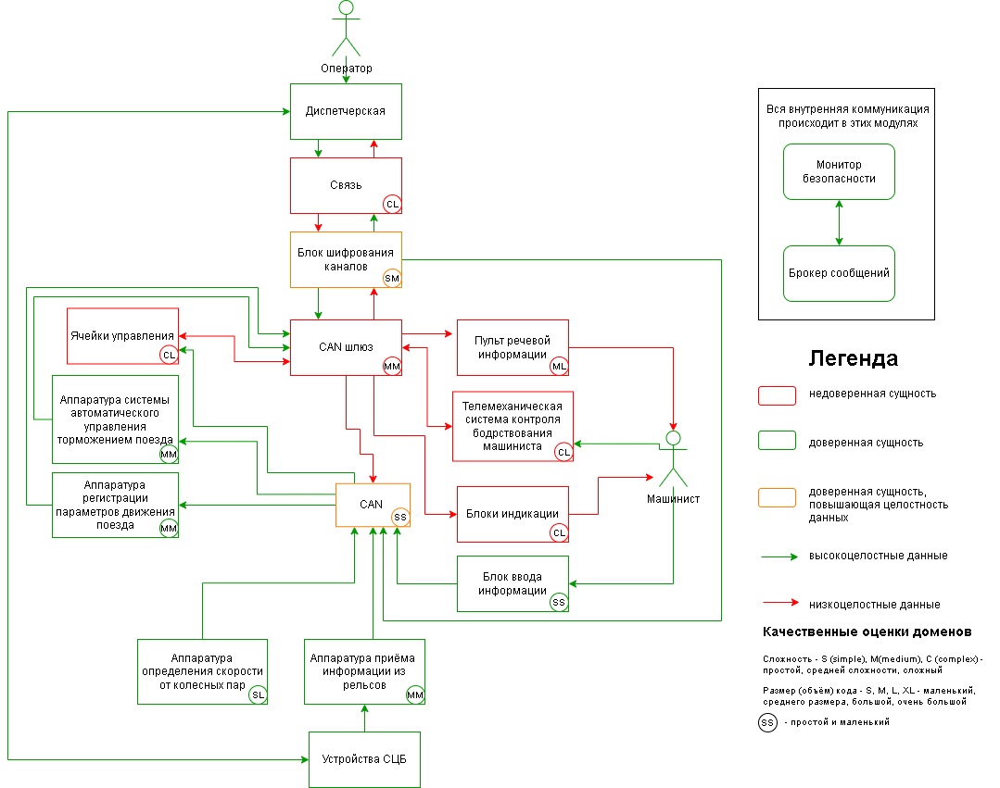

# Отчёт о выполнении задачи БЛОК

- [Отчёт о выполнении задачи БЛОК"](#отчёт-о-выполнении-задачи-name)
  - [Постановка задачи](#постановка-задачи)
    - [Цели и Предположения Безопасности (ЦПБ)](#цели-и-предположения-безопасности-цпб)
  - [Архитектура системы](#архитектура-системы)
    - [Контекст работы системы](#контекст-работы-системы)
    - [Компоненты](#компоненты)
    - [Алгоритм работы решения](#алгоритм-работы-решения)
    - [Описание Сценариев (последовательности выполнения операций), при которых ЦБ нарушаются](#описание-сценариев-последовательности-выполнения-операций-при-которых-цб-нарушаются)
    - [Переработанная архитектура](#переработанная-архитектура)
    - [Указание "доверенных компонент" на архитектурной диаграмме.](#указание-доверенных-компонент-на-архитектурной-диаграмме)
    - [Политики безопасности](#политики-безопасности)

## Постановка задачи

БЛОК – безопасный локомотивный объединенный комплекс, который обеспечивает безопасное движение поезда на протяжении всего маршрута движения, связывается с диспетчерскими системами и системами СЦБ (устройства сигнализации, централизации и блокировки).
В рамках дипломного проекта предлагается.

- переработать архитектуру с учётом целей безопасности;
- декомпозировать систему и отделить критический для целей безопасности код;
- внедрить в архитектуру компонент «монитор безопасности» и реализовать контроль взаимодействия всех подсистем БЛОК;
- создать автоматизированные тесты, демонстрирующие работу механизмов защиты.

Ценности, ущербы и неприемлемые события (гипотеческие)

|Ценность|Негативное событие|Оценка ущерба|Комментарий|
|:-:|:-:|:-:|:-:|
|1. Поезд| Вследствие искажения данных при приёме от диспетчерского пункта, состав врезался впереди идущий поезд.| Высокий| Экономический и репутационный ущерб|
|2. Поезд| При анализе данных о состоянии поезда были искажены данные от модулей связи и от АЛСН/АЛС-ЕН, вследствие чего поезд не снизил скорость и сошёл с рельс при прохождении кривой| Высокий| Экономический и репутационный ущерб|
|3. Инфраструктура| Диспетчерский пункт передает неверные команды|  Высокий||
|4. Люди| Инженер по диагностике использует оборудование, которое было скомпрометировано, в результате чего данные о маршруте и данные, сохраняемые в блоке регистрации, оказались не аутентичные, что привело к аварии| Высокий||
|5. Инфраструктура| Система СЦБ передает ложные значения о состоянии объектов -рельсовые цепи, светофоры, стрелочные переводы| Высокий| БЛОК может принять неправильное решение о торможении/снижении скорости, что может привести к аварии|
|6. Данные о состояния поезда| При отправке данных от локомотива в диспетчерский пункт данные были искажены, вследствие чего была принята команда об экстренном торможении| Высокий| Так как график движения поездов фиксированный, то возможна авария или сход состава|

### Цели и Предположения Безопасности (ЦПБ)

Цели безопасности:

1. выполняются только аутентичные задания на движение поезда;
2. выполняются только авторизованные диспетчерским пунктом задания;
3. все маневровые работы выполняются согласно ограничениям в маршруте;
4. только авторизованные получатели (диспетчеры, машинисты и др.) имеют доступ к оперативным данным.

Предположения безопасности:

1. аутентичный диспетчерский пункт благонадёжен;
2. аутентичные сотрудники благонадёжны и обладают необходимой квалификацией;
3. только авторизованные сотрудники управляют системами;
4. экстренное торможение не является нарушением задания;
5. только инженер по эксплуатации имеет физический доступ к аппаратуре регистрации параметров движения поезда.

## Архитектура системы

Структурная схема БЛОК



### Компоненты

Базовая архитектура



Информационное взаимодействие



Упрощенная диаграмма последовательности



Базовая диаграмма последовательности



|Компонент|Назначение|
|:--|:--|
|1. Связь| Модуль, в который входят все типы связи с системами, такие как GPS, GSM, ГЛОНАСС, антенна 160 МГЦ|
|2. CAN шлюз| Общая шина данных объединяет в себе внешний и внутренние CAN линии|
|3. Ячейки управления| Центральная система расчёта параметров движения, принятие решения о торможении, проверка машиниста и т.д. |
|4. Аппаратура системы автоматического управления торможением поезда| Занимается расчётом торможения, формированием команд на экстренное торможение, осуществляет контроль скорости и учет ограничений скорости|
|5. Аппаратура регистрации параметров движения поезда| Сохранение параметров локомотива, ЭК, оперативных данных. Отправка данных при необходимости их в другие модули|
|6. Аппаратура определения скорости от колесных пар| Расчёт скорости движения локомотива на основе оборотов колесной пары.|
|7. Аппаратура приёма информации из рельсов| Приём и обработка информации, получаемой от устройств СЦБ|
|8. Пульт речевой информации| Включает звуковые сигналы в зависимости от полученных кодов устройств СЦБ|
|9. Телемеханическая система контроля бодрствования машиниста| Состоит из трех частей: носимой машинистом частью, блоком приема сигнала от носимой части и контролем бдительности машиниста. Служит для определения физиологических параметров и работоспособности машиниста|
|10. Блоки индикации| Отображение машинисту информации о локомотиве, сигналов СЦБ, блок ввода параметров локомотива, выбора частоты приема сигналов от устройств СЦБ|

### Алгоритм работы решения

### Описание Сценариев (последовательности выполнения операций), при которых ЦБ нарушаются

Нарушение ЦБ (Целей безопасности) в базовом решении

Напоминание ЦБ:

1. Выполняются только аутентичные задания на движение поезда;
2. Выполняются только авторизованные диспетчерским пунктом задания;
3. Все манёвровые работы выполняются согласно ограничениям в маршруте;
4. Только авторизованные получатели имеют доступ к оперативным данным.

|Атакованный компонент|ЦБ1|ЦБ2|ЦБ3|ЦБ4|Кол-во нарушений|
|:--|:-:|:-:|:-:|:-:|:-:|
|1. Связь |Да| Да| Да| Да |4/4|
|2. CAN шлюз |Нет |Нет |Нет| Нет| 0/4|
|3. Ячейки управления |Нет |Нет |Да |Нет| 1/4|
|4. Аппаратура системы автоматического управления торможением поезда |Да |Да| Да| Нет| 3/4|
|5. Аппаратура регистрации параметров движения поезда |Да| Да| Нет| Нет| 2/4|
|6. Аппаратура определения скорости от колесных пар| Нет| Нет| Да |Нет| 1/4|
|7. Аппаратура приёма информации из рельсов| Да| Да| Да| Нет| 3/4|
|8. Пульт речевой информации| Нет |Нет| Нет| Нет| 0/4|
|9. Телемеханическая система контроля бодрствования машиниста| Нет| Нет| Нет| Нет| 0/4|
|10. Блоки индикации| Нет| Нет| Нет| Нет| 0/4|

|Название сценария|Описание|
|---|----------------------|
|1. НС-1| При отправке команды на экстренное торможение, команда была искажена в среде передачи и поезд не осуществил торможение, что нарушает ЦБ 1, 2, 3|
|2. НС-2| При отправке оперативных данных поезда в канал передачи данных подключился злоумышленник и получил оперативные данные, что нарушает ЦБ 4 |
|3. НС-3| Ячейки управления и САУТ скомпрометированы и дают команды на повышение скорости, не смотря на ограничения скорости, что нарушает ЦБ 1, 2, 3|
|4. НС-4| Сохраненные данные в аппаратуре регистрации параметров движения поезда были изменены, что нарушает ЦБ 3|
|5. НС-5| Аппаратура определения скорости от колесных пар, выдает неверную скорость, отличающуюся от действительной, что нарушает ЦБ 3 |
|6. НС-6| Были искажены сигналы от устройств СЦБ из-за чего не своевременно была снижена скорость или случилась авария, что нарушает ЦБ 1, 2, 3|
|7. НС-7| При внесении параметров поезда, Блок индикации скомпрометирован и отправил не достоверные данные о маршруте, что нарушает ЦБ 3|

### Переработанная архитектура



### Таблица новых компонентов

|Компонент|Описание|Комментарий|
|:---|:--|:--|
|1. CAN| Дополнительная CAN шина для передачи данных||
|2. Блок ввода информации| Клавиатура для ввода параметров локомотива машинистом и выбора частоты приема сигналов от устройств СЦБ|В БЛОК уже реализованный модуль|
|3. Блок шифрования каналов| Расшифрование/шифрование принимаемых/отправляемых пакетов данных.| Работает при помощи SSL протокола|





#### Таблица доверенных компонентов

|Компонент|Уровень доверия|Обоснование|Комментарий|
|:--|:--|:--|:--|
|1. Связь| Недоверенный|||  
|2. CAN шлюз| Недоверенный |||
|3. Ячейки управления| Недоверенный|||  
|4. Аппаратура системы автоматического управления торможением поезда| Доверенный| Смотри НС - 3 |При компрометации ячеек управления данный модуль будет экстренно тормозить при странном поведении поезда, так как команды от данной системы являются приоритетом|
|5. Аппаратура регистрации параметров движения поезда| Доверенный |Смотри НС-4||
|6. Аппаратура определения скорости от колесных пар| Доверенный| Смотри НС-5||
|7. Аппаратура приёма информации из рельсов| Доверенный| Смотри НС-6||
|8. Пульт речевой информации| Недоверенный|||  
|9. Телемеханическая система контроля бодрствования машиниста| Недоверенный|||  
|10. Блоки индикации| Недоверенный|||
|11. CAN| Доверенный, повышающий целостность данных| Для соблюдения ЦБ 1, 2, 3| Требуется для того, чтобы данные при прохождение системы не искажались и САУТ могла всегда экстренно затормозить.|
|12. Блок ввода информации| Доверенный| Смотри НС-7 ||
|13. Блок шифрования каналов| Доверенный, повыщающий целостность данных| Смотри НС 1, 2 ||

#### Качественная оценка доменов

|Компонент|Доверие|Оценка|Кол-во входящих интерфейсов|Комментарий|
|:--|:-:|:-:|:-:|:--|
|1. Связь| Недоверенный| CL| 2 |Комплекс устройств, обеспечивающий связь по GSM, GPS, ГЛОНАСС|
|2. CAN шлюз| Недоверенный| MM| 5| Общая шина CAN с устройством преобразования сигналов для связи внешнего CAN и внутреннего CAN. А так же служит для связи с остальной бортовой сетью локомотива.|
|3. Ячейки управления| Недоверенный |CL |1| Центральный обработчик сигналов, расчёт маневров поезда, отправка данных и их запись в системы хранения.|
|4. Аппаратура системы автоматического управления торможением поезда| Доверенный |MM| 1| Расчёт торможения поезда по приходящим параметрам.|
|5. Аппаратура регистрации параметров движения поезда| Доверенный| MM| 1| Устройство записи данных и устройство хранения данных|
|6. Аппаратура определения скорости от колесных пар| Доверенный |SL| 0| Датчики пути и скорости, устанавливаемые на колесную пару.|
|7. Аппаратура приёма информации из рельсов| Доверенный| MM| 1| Катушки для приема сигналов из рельсов. Работают как на низких частотах, так и на высоких частотах.|
|8. Пульт речевой информации| Недоверенный| ML| 1| Воспроизводит речевые сообщения, формируемые аппаратурой.|
|9. Телемеханическая система контроля бодрствования машиниста| Недоверенный| CL| 2 |Состоит из нескольких устройств для проверки бодрствования машиниста. |
|10. Блоки индикации| Недоверенный |CL |1 |Дисплей, отображающий все параметры поезда, сигналы светофоров.|
|11. CAN| Доверенный, повышающий целостность данных |SS| 5| CAN шина|
|12. Блок ввода информации| Доверенный| SS |1 |Клавиатура|
|13. Блок шифрования каналов| Доверенный, повышающий целостность данных| SM |2 |Программный модуль, реализующий в себе криптографические функции|

|Компонент|Соответствие|
|-----|-----|
|1. Связь| con|
|2. CAN шлюз |can|
|3. Ячейки управления| iy|
|4. Аппаратура системы автоматического управления торможением поезда| saytp|
|5. Аппаратура регистрации параметров движения поезд|а rpdp|
|6. Аппаратура определения скорости от колесных пар| oskp|
|7. Аппаратура приёма информации из рельсов| pir|
|8. Пульт речевой информации| pri|
|9. Телемеханическая система контроля бодрствования машиниста| tskbm|
|10. Блоки индикации| bi|
|11. Диспетчерский пункт| disp|
|12. Устройства СЦБ| scb|
|13. CAN| trustCan|
|14. Блок ввода информации| bvi|
|15. Блок шифрования каналов| chipher|

### Политики безопасности

```python {lineNo:true}
policies = (
    {"src": "con", "dst": "chipher "},
    {"src": " chipher ", "dst": "con"},
    {"src": "chipher", "dst": "can"},
    {"src": "chipher", "dst": " trustCan "},
    {"src": "can", "dst": "chipher "},
    {"src": "can", "dst": " pri"},
    {"src": "can", "dst": " tskbm"},
    {"src": "can", "dst": " bi "},
    {"src": "can", "dst": " trustCan "},
    {"src": " tskbm", "dst": " can "},
    {"src": " iy", "dst": " can "},
    {"src": "saytp", "dst": " can "},
    {"src": " rpdp ", "dst": " can "},
    {"src": " bvi ", "dst": " trustCan "},
    {"src": " pir ", "dst": " trustCan "},
    {"src": " oskp ", "dst": " trustCan "},
    {"src": " trustCan ", "dst": " rpdp "},
    {"src": " trustCan ", "dst": " saytp "},
    {"src": " trustCan ", "dst": " iy "}
)

def check_operation(id, details) -> bool:
    src: str = details.get("source")
    dst: str = details.get("deliver_to")
    if not all((src, dst)):
        return False
    print(f"[info] checking policies for event {id}, {src}->{dst}")
    return {"src": src, "dst": dst } in policies
```

### Результаты тестов безопасности

``` make test ```

Тесты безопасности включали в себя проверку политики безопасности, путем проверки взаимодействия систем между собой.
